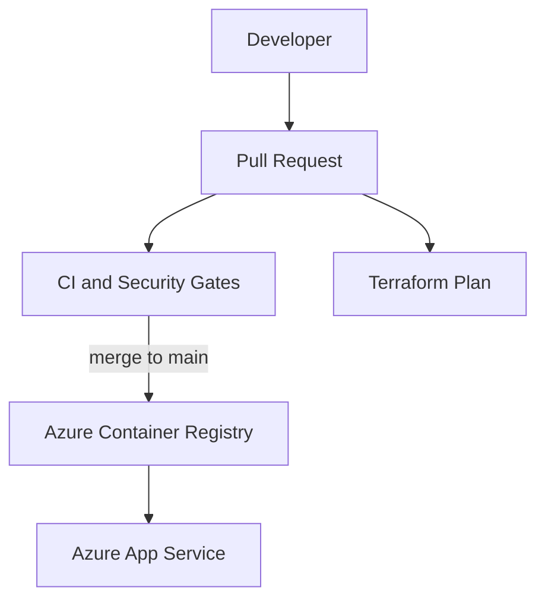

# Azure Resilience Control Tower

Enterprise-style sample project combining:

- Azure App Service for a containerized web app
- Azure Container Registry for image storage
- Terraform for infrastructure provisioning
- GitHub Actions for CI/CD and DevSecOps controls
- Python test code with Docker-based delivery

## Architecture



## Repository Structure

- `app/`: sample Flask app, tests, and Dockerfile
- `infra/`: Terraform for Azure resources
- `docs/`: branching, controls, and platform guidance

## What Gets Deployed

- Azure Container Registry
- Linux App Service Plan
- Linux Web App pulling a container from ACR
- Log Analytics workspace
- Application Insights
- Managed identity with `AcrPull`

Resources are deployed into an existing resource group that you provide to Terraform.

## CI/CD and DevSecOps

This project includes:

- PR quality gates for Terraform and Python
- `tflint`, `tfsec`, CodeQL, Bandit, `pip-audit`, and Trivy
- SBOM generation for the deployed container image
- Cosign signing, verification, and SBOM attestation for the pushed ACR image
- Terraform plan workflow for change review
- production deployment workflow protected by GitHub Environments
- Dependabot, CODEOWNERS, PR template, and security policy inherited from repo root

Detailed operating guidance lives in `docs/devsecops-cicd.md`.

## GitHub Configuration

Create these repository or environment secrets:

- `AZURE_CLIENT_ID`
- `AZURE_TENANT_ID`
- `AZURE_SUBSCRIPTION_ID`

Create these repository or environment variables:

- `AZURE_LOCATION`
- `PROJECT_NAME`
- `ENVIRONMENT_NAME`
- `RESOURCE_GROUP_NAME`
- `TFSTATE_RESOURCE_GROUP_NAME`
- `TFSTATE_STORAGE_ACCOUNT_NAME`
- `TFSTATE_CONTAINER_NAME`
- `TFSTATE_KEY`

## Local Development

### Run the app

```bash
cd azure-resilience-control-tower/app
python -m venv .venv
source .venv/bin/activate
pip install -r requirements-dev.txt
python -m flask --app src.main run --debug
```

### Run tests

```bash
cd azure-resilience-control-tower/app
pytest
```

### Build the container

```bash
cd azure-resilience-control-tower/app
docker build -t resilience-control-tower:test .
```
